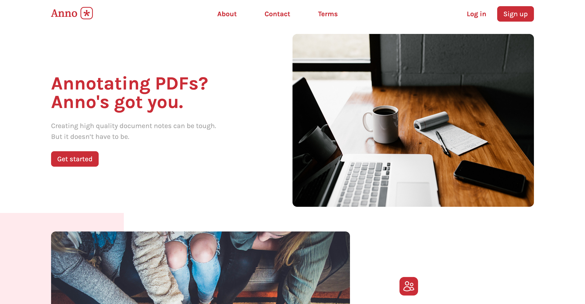

# Anno
A collaborative PDF annotation suite for the web.




Created for SOFTENG 750 at the University of Auckland.

## About
**Team:** Fearless Foxes

**Members:**
 * Matthew Jakeman (mjak923)
 * Ben Lowthian (blow247)
 * Ojas Madaan (omad882)
 * Jia Tee (jtee256)
 * Jordan York (jyor212)
 * Matan Yosef (myos911)

## Features
Anno supports:

 - Real time collaborative whiteboard
 - PDF annotations with text and pen
 - Share documents with permissions
 - Email based invitations
 - File management and upload
 - Export annotated documents to PDF

## Technology
Anno is built on modern web technology, utilising MongoDB, Express, React, and Node.js (i.e. the MERN stack).

It is composed of two modules: the
`frontend` and the `backend`.

### Common Technologies
 * **Socket.io** brings real-time collaboration primitives and enables communication with the backend server.
 * **TypeScript** adds typing and structure in order to provide a necessary  level of compile-time safety given the complexity of the project.

### Frontend Libraries
 * **React** is used for building the interface. Anno takes advantage of React's flexible state management to create a complex fully-interactive whiteboard with real time collaboration built-in from the start.
 * **fabric.js** provides the client-side whiteboard implementation. This is extended with a collaboration layer which marshals additions, modifications, and deletions from the canvas with other peers and the backend persistence store.
 * **PDF.js** is used to render PDF pages. This is a mature and scalable solution which neatly integrated into fabric.js.
 * **jsPdf** (not to be confused with PDF.js) is used for implementing PDF export by constructing a new PDF document from our internal annotation representation.
 * **Tailwind CSS** is used to make styling more maintainable. Combined with React, it allows for efficient construction of reusable components.
 * **Cypress** is a frontend E2E testing framework used to validate the behaviour of the frontend.

### Backend Libraries
 * **Express** is the web framework powering the Anno backend. It allows for efficient iteration and compatibility with the data structures used in the frontend.
 * **Mongoose** is our ORM for persisting application state to MongoDB. It provides a helpful convenience layer over Mongo.
 * **Jest** is the JavaScript testing framework used to create the backend test fixtures.
 * **Supertest** allows for the easy creation of test servers and is used to verify the functionality of our express-based backend. 
 * **Nodemailer** provides email sending capabilities for the invitation system.

### Auxiliary Technologies
 * **Heroku** is the cloud service platform used to deploy Anno. We achieve continuous deployment for every commit on the `main` branch.
 * **MongoDB** provides data persistence for users, documents, and annotations. This allows for annotations to be stored across restarts of the backend server.
 * **Firebase** provides authentication and token functionality which is integrated into our backend. Requests are secured to prevent data leakage.
 * **Amazon S3** stores uploaded documents and enables the application to fetch them on-demand. We use Amazon's highly performant CDN to provide fast and efficient document retrieval.
 * **GitHub Actions** provided continuous integration to the project. Four build checks (for the frontend and backend across the latest Node.js and the Node.js LTS) and two deployment tasks (for frontend and backend deployment to Heroku) were used.

## Try
Please allow up to 30s when first accessing Anno for the container to resume.

[Click here to try Anno](https://anno-pdf.herokuapp.com/).

### Deployment Details
Anno is deployed on a production server using Heroku Dynos.

The frontend is deployed to https://anno-pdf.herokuapp.com/.

The backend is deployed to https://anno-pdf-backend.herokuapp.com/.


## Building
Anno is developed using a cloud-first philosophy. The backend and frontend can be run locally however it depends on the presence of the MongoDB server and S3 bucket for document delivery.

**Please ensure an internet connection is present when following the instructions below.**

### Environment Setup
A `.env` file is needed for both the frontend and the backend, containing API Keys and other relevant deployment information.

#### Frontend
Place a file at `/backend/.env` and enter the following content:

```dotenv
MONGODB_URI=mongodb+srv://<provide-your-own>
PORT=8080
ENVIRONMENT=PROD
AWS_ACCESS_KEY=<provide-your-own>
AWS_SECRET_ACCESS_KEY=<provide-your-own>
AWS_BUCKET=<provide-your-own>
TEST_UID=<provide-your-own>
FIREBASE_CONFIG_BASE64=<provide-your-own>
GMAIL=<provide-your-own>@gmail.com
GMAIL_PASSWORD=<provide-your-own>
FRONTEND_BASE_URL=http://localhost:5173
```

#### Frontend
Place a file at `/frontend/.env` and enter the following content:

```dotenv
VITE_FB_AUTH_API_KEY=<provide-your-own>
VITE_FB_AUTH_AUTH_DOMAIN=<provide-your-own>
VITE_FB_AUTH_PROJECT_ID=<provide-your-own>
VITE_FB_AUTH_STORAGE_BUCKET=<provide-your-own>
VITE_FB_AUTH_MESSAGING_SENDER_ID=<provide-your-own>
VITE_FB_AUTH_APP_ID=<provide-your-own>
VITE_BACKEND_URL=http://localhost:8080
VITE_FRONTEND_URL=http://localhost:5173
```

Additionally, create another file at `/frontend/Cypress.env.json` and enter:

```json
{
    "API_TOKEN": "<provide-your-own>"
}
```

### Running Locally
With the S3 Bucket and MongoDB instance configured as above, the project is now ready to be run locally.

You will need to run both the frontend and the backend simultaneously for the application to function.

#### Compilation
Anno is a typical Node.js project. You can build it using `npm`.

In terminal 1:

```bash
# Enter the frontend directory
cd frontend

# Install dependencies
npm install

# Run frontend app
npm run dev
```

In terminal 2:

```bash
# Enter the backend directory
cd backend

# Install dependencies
npm install

# Run backend app
npm run dev
```

### Testing
Ensure your environment is configured as described above.

To run the backend api and schema tests, run `npm test` in the backend directory.

To run the frontend cypress tests (locally), ensure both the backend server and frontend are running (following the instructions above in the [compilation](#compilation) section).
Then, in a new terminal in the frontend directory - run `npm test`. When the cypress window opens, follow the setup prompts if any, then select End-to-End testing and Chrome as the browser.
This will take you to the spec files, where you can select an End-to-End test to run.

## Project Management
The team decided on using Jira for project management, as it is a powerful and widely used issue tracker solution which the team is experienced with. This is used as our 'source of truth' for task allocations.

The Jira instance can be found at https://pdfcollab.atlassian.net/.

Access permission has been given to Andrew Meads. Please contact the team for any additional access to the Jira board.

### Branch Strategy
A branch has been created for each Jira ticket. The Jira workflow is set up to automatically update issue statuses when certain actions occur. For example, when opening a Pull Request, the issue will be moved to the 'In Review' status.

Branch names should take the format of `PDF-<key>-optional-short-description-of-issue`.

### Feature Freeze
A feature freeze was instituted on the morning of the deliverable. All further work on Friday 12 May  focused on polish, robustness, and code quality.


## Wiki, Meetings, and Communication

Notion was used as our Wiki and Knowledge Base. All meeting minutes, architectural decisions, and supplementary documentation is recorded here.

The Notion can be viewed through this link: [Team Notion Site Invitation](https://uncovered-aftershave-870.notion.site/SOFTENG-750-Anno-Team-Fearless-Foxes-8ea5b6d8044e467793413bf6cf217367).

### Meetings
The team had an 'official' meeting weekly and a shorter standup on a close-to-daily basis. Task allocations from meetings are recorded comprehensively on Jira. Where architectural decisions were made, mainly in the early weeks, these are recorded on Notion.

### Slack
A Slack workspace was created for asynchronous communication. The team used this for general discussion, requesting code reviews, and technical help.
